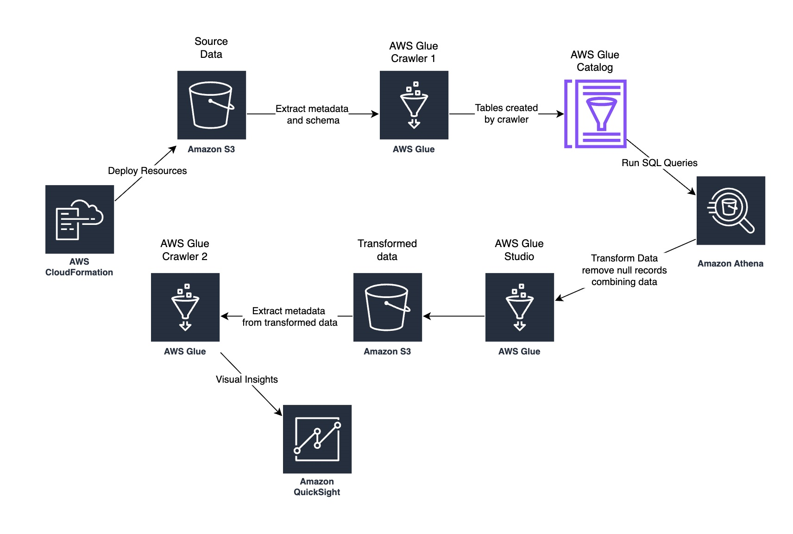

# 📊 Serverless Data Lake Architecture on AWS

In today's data-driven world, organisations deal with massive volumes of structured and unstructured data coming from various sources. To manage, store, and analyse this diverse data efficiently, **Data Lakes** have emerged as a flexible and scalable solution.

A **Data Lake** is a centralised repository that allows you to store all your data — structured, semi-structured, and unstructured — at any scale. You can store your data as-is, without having to structure it first, and run different types of analytics — from dashboards and visualisations to big data processing, real-time analytics, and machine learning — to guide better decisions.

While traditional data lakes often require managing servers, storage, and complex pipelines, a **Serverless Data Lake** takes this a step further by removing the need to manage infrastructure.

---

## 🚀 About the Project

In this project, I have implemented a **Serverless Data Lake architecture** using various **AWS services** through one of AWS's official workshops.

The workflow includes:

- **Data Ingestion**
- **Data Transformation**
- **Data Visualization**

All of this was accomplished without provisioning or managing any servers.

This end-to-end solution was built using the following AWS tools:

- AWS CloudFormation
- Amazon S3
- AWS Glue
- Amazon Athena
- Amazon QuickSight

---

## 🧱 Architecture Overview

<!-- Replace with your actual image path or link -->

---

## ✍️ Read More

📖 For detailed steps and insights, check out my blog on Medium:  
👉 [Read the full article on Medium](https://medium.com/@singh04angad/serverless-data-lake-74fc4a2c18c3)
<!-- Replace with your actual Medium URL -->

---

## 🛠 Technologies Used

- **AWS S3** – Data storage  
- **AWS Glue** – Data transformation  
- **Amazon Athena** – Querying data  
- **Amazon QuickSight** – Data visualization  
- **CloudFormation** – Infrastructure as code  

---

## 📬 Contact

For any queries or suggestions, feel free to reach out!

